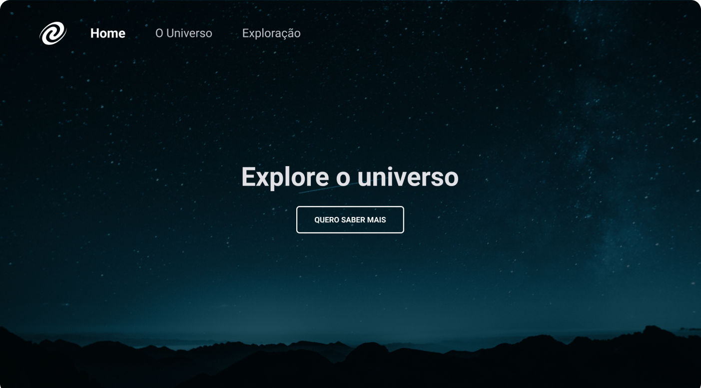

<h1 align="center"> Projeto FocusTimer </h1>

Programa exclusivo e gratuito, promovido pela Rocketseat para ensino de tecnologias WEB.

  <a href="#-tecnologias">Tecnologias</a>&nbsp;&nbsp;&nbsp;|&nbsp;&nbsp;&nbsp;
  <a href="#-projeto">Projeto</a>&nbsp;&nbsp;&nbsp;|&nbsp;&nbsp;&nbsp;
  <a href="#-layout">Layout</a>&nbsp;&nbsp;&nbsp;|&nbsp;&nbsp;&nbsp;
  <a href="#memo-licença">Licença</a>

  

 

## 🚀 Tecnologias

Esse projeto foi desenvolvido com as seguintes tecnologias:

- HTML e CSS
- JavaScript
- Git e Github
- Figma

## 💻 Projeto

O Universe project é um desafio proposto no nivel 06 do bootcamp da Rocketseat para abordar conceitos como:
 
- Conceitos de SPA; 
- Mapeamento de rotas; 
- Assíncrono e promises; 
- Orientação a objetos; 
- Classes e muito mais.

Você pode visualizar o projeto através [DESSE LINK](https://gbenini.github.io/spa-universe-project/) 👀

## 🔖 Layout

Você pode visualizar o layout do projeto através [DESSE LINK](https://www.figma.com/file/g1jWHgQY7X8eialnk4mt2T/%5BDesafios-Explorer%5D-SPA-Universe-(Copy)?type=design&node-id=104-614&mode=design&t=O3EsnTf3n0nOJUYA-0). É necessário ter conta no [Figma](https://figma.com) para acessá-lo.

## :memo: Licença

Esse projeto está sob a licença MIT.

---

Feito com ♥ by GBenini e Rocketseat :wave: [Participe da nossa comunidade!](https://discord.gg/rocketseat)